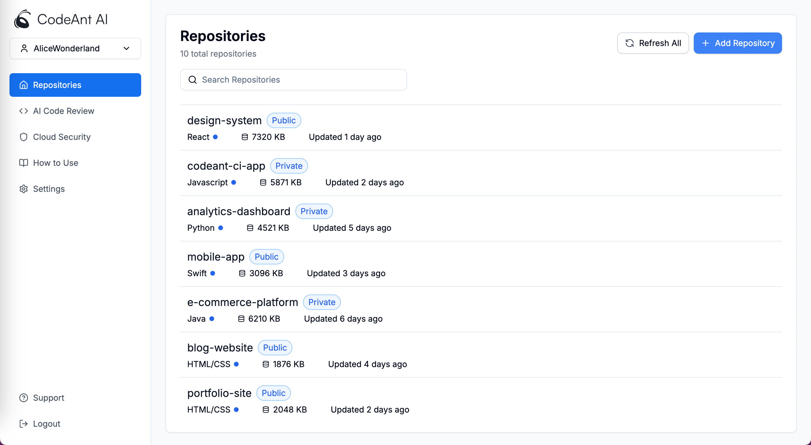

# CodeAnt AI Dashboard

This web app manages and displays repositories with features like search, filter, and refresh. I simulated login, refreshing functionalities.

## Design Decisions

### Component-Based Architecture
Built with React components for modularity and reusability.

- **App Component**: Sets up routing with `react-router-dom` to the main dashboard.
- **RepositoryListing Component**: Lists repositories with search and refresh features using React hooks.
- **RepoCard Component**: Shows repository details like name, visibility, language, size, and last update.
- **Sidebar Component**: Offers navigation with a collapsible menu.

### State Management
Uses React hooks (`useState`, `useEffect`, `useMemo`) for efficient state and side effect management.

### UI and Styling
Styled with Tailwind CSS (w/ Shadcn UI) for rapid development and easy customization.

### Icons and UI Components
Uses `lucide-react` and `simple-icons` for a consistent look. Custom components like `SearchInput` and `Sidebar` ensure cohesive design.

<div style="display: flex; flex-wrap: wrap; gap: 10px; justify-content: center;">
  
  
</div>

## Thought Process

Goals: Create a user-friendly interface for managing repositories.

- **Usability**: Intuitive navigation with prominent search and refresh features.
- **Performance**: Responsive with React's memoization and efficient state management.
- **Scalability**: Reusable components for easy future enhancements.
- **User Flow**: Login at `/login`, redirect to `/dashboard`, simulate actions with `setTimeout`.

## Getting Started

To run locally:

1. Clone the repository:
   ```bash
   git clone https://github.com/sarkartanmay393/coding-codeant.git
   ```
2. Navigate to the project directory:
   ```bash
   cd coding-codeant
   ```
3. Install dependencies:
   ```bash
   npm install
   ```
4. Start the development server:
   ```bash
   npm start
   ```

Access the app at `http://localhost:3000`.

## Conclusion

Coding CodeAnt is a robust UI for managing repositories, focusing on modularity, performance, and user experience.
